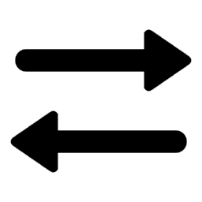
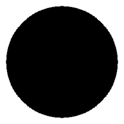

 
# Voxel Learning in DIVA

Three-dimensional imaging is at the core of medical imaging and is becoming a standard in biological research. There is an increasing need to visualize, analyze and interact with data in a natural three-dimensional context. By combining stereoscopy and motion tracking, commercial virtual reality (VR) headsets provide a solution to this important visualization challenge by allowing any user to view volumetric image stacks in a highly intuitive fashion. 

**DIVA** (Data Integration and Visualisation in Augmented and virtual environments) software is a user-friendly platform that generates volumetric reconstructions from raw 3D microscopy image stacks and enables efficient visualization and quantification in VR without pre-treatment. We introduce here **Voxel Learning**, a new procedure to quickly annotate and analyze 3D data by combining VR and cloud computing.

**Voxel Learning** makes the following contributions to the field:
1. **Natural interactions with volumetric representations**: VR is leveraged to provide the user an adapted environment, where he can interact intuitively with experimental imaging data.
2. **Simple annotation procedure**: Tagging in VR can be done in a few strokes with the controller. The updated interface of DIVA provides user-friendly tools to train learners and launch inference.
3. **Efficient computation**: While VR can be demanding in local computational resource, DIVA Cloud is used to delegate costly computations to a server.

For more information, read the following paper: REF preprint ?? 

# Table of Contents
- [Installation and Requirements](#installation-and-requirements)
- [Apply Voxel Learning to your data](#apply-voxel-learning-to-your-data)
  * [Load your image](#load-your-image)
  * [Improve visualization](#improve-visualization)
  * [Annotate in VR](#annotate-in-vr)
  * [Compute locally or remotely](#compute-locally-or-remotely)
  * [Train your model](#train-your-model)
  * [Perform and visualize inference](#perform-and-visualize-inference)
- [Iterate the procedure](#iterate-the-procedure)
- [Example](#example)

# Installation and Requirements
DIVA is designed to run on the Windows 10 operating system with at least OpenCL 2.0. We recommend using DIVA with an Intel i5 processor equivalent or better, at least 4GB RAM of memory, 300 MB of storage and a NVIDIA GeForce 900 Series or better Graphical Processing Unit (GPU). DIVA can be used with and witout VR headset and is compatible with HTC Vive, HTC Vive Pro, Oculus Rift, Oculus Rift S, Oculus Quest (with Link Cable) and Windows Mixed Reality headsets. For each type of VR headsets you have to download the corresponding installation software (such as [ViveSetup](https://www.vive.com/fr/setup/pc-vr/) or [Oculus](https://www.oculus.com/setup/?locale=fr_FR)). In addition, [SteamVR](https://www.steamvr.com/fr/) is required to use VR functions. You can find DIVA user manual and all the information about the legacy software [here](https://diva.pasteur.fr/). 

1. Install [Python 3.7.4](https://www.python.org/downloads/windows/).
2. Install Python packages.
> $ `pip install -r requirements.txt` use this [requirements.txt file](/diva_cloud/diva_django/requirements.txt)
3. Install DIVA Cloud (only for remote computation) : load the [diva_dango](/diva_cloud/diva_django/) and [diva_docker](/diva_cloud/diva_docker) folders and follow instructions on README files.
4. Launch SteamVR before DIVA software if you want to use VR environment.
5. Install DIVA : choose in the [*diva_voxel_learning* folder](/diva_voxel_learning) the version of the updated software you want to use : one uses 56 features for voxel learning (see details in the article) and the other uses only pixel neighborhood information. Load the corresponding folder and execute DIVA by double-clicking on the provided *diva.exe* file. DIVA will take a moment to load as it allocates memory (roughly 20–30 seconds).

# Apply Voxel Learning to your data
 
For a complete voxel learning pipeline example see this [video](/materials/article_videos/VideoS1_DIVA_learning_pipeline.mp4). 
 

 ## Load your image
The voxel learning process requires Tagged Image File Format (TIFF) image files in 8 or 16-bits. We recommend limiting the size of loaded files to less than 1 GB. Larger files may be scaled or cropped via [ImageJ/Fiji](https://imagej.net/software/fiji/downloads) for example. Multichannel files organized using the ImageJ/Fiji convention are supported. To improve DIVA performances, use images that are located on your disk.

If your original data is stored in a DICOM format (such as in the [example](/materials/data_examples/breast_cancer_image_01/raw_data/), you have to convert the data to a TIFF format with ImageJ/Fiji for example : 
 
 1) Open the DICOM image via *Plugins/bio-Fromats/Bio-Formats* Importer with options :
    - View stack with : Hyperstack
    - Group files with similar names : ON
    - Open all series : ON
    - All other options are OFF
2) Improve visualization with *Image/Adjust/Brightness* => Click on **Auto**
3) Make sure that the format is 8 or 16bit, if not change it in *Image/Type/* 
4) Save as TIFF format : *File/Save As/Tiff*

Importation can then be done in DIVA using the  button with the *TIFF* option (in the top-left corner) which opens a file browser or by drag-and-dropping your TIFF file direclty. 

## Improve visualization

Voxel color and opacity can be modified in real-time through a user-friendly transfer function interface located in the **Volume** panel under  or  icon. This interface is composed of the image histogram in gray, one white curve for the opacity and one color bar. Each of them are defined with control points which can be adjusted by dragging with the left mouse button (more details on the [DIVA user manual](https://diva.pasteur.fr/wp-content/uploads/2019/09/diva-viewer-manual.pdf)). The basic principle of the transfer function is that each pixel of the histogram under the curve will be displayed with the corresponding color in the color bar, and each pixel above the curve will be disabled in the 3D and VR view. For multichannel files, each channel possesses its own transfer function which can be activated by left clicking on the corresponding channel icon in the *Volume* panel.

We recommend you to customize this transfer function to highlight your object of interest and save it as .json file using the **Save** button in order to be able to re-open if necessary.

## Annotate in VR
Switching to and from the VR mode is performed by clicking on  in the top-left corner and will automatically launch SteamVR to activate the plugged VR headset. *IMPORTANT* : this button will not respond if SteamVR is not installed.
In the VR environment, you can iteract with the volume through the VR controller (for interaction details see [DIVA user manual](https://diva.pasteur.fr/wp-content/uploads/2019/09/diva-viewer-manual.pdf)). 
 
For the tagging step you have to first activate the **Clipper Tool** to cut in real-time in the volume and then use the **Tagger tool**. Tagging is done with the VR controller by clicking on the  button and choosing the tag's color (cyan for positive tags and magenta for negative tags). A video example is available [here](/materials/article_videos/VideoS2_DIVA_tagging_lung_image01_29-97fps.mp4). All the tags can be saved as .json file (in order to be re-opened later in DIVA) by clicking on **VR Annotations** in the top-right corner, then on the icon  and on the **Export** button.

## Compute locally or remotely
Once the tagging step is done, open the dedicated **Voxel Learning** panel by clicking on **Advanced** in the top right corner and then on the following pictogram . 

Click on  to choose **Local** or **Cloud** computation. In the latter, you should specify which **Server** and **Port** you want to use.

## Train your model

Click on the yellow rectangle labelled **New Classifier** to browse your folder and create a pickle file (**.pckl**).

Select which learner you want to train by modulating the slider **Strength** from 1 to 6:

 - 1: Random Forest Classifier (RFC)
 - 2: Gradient Boosting Classifier (XGB)
 - 3: Linear classifier with Stochastic Gradient Descent learning (SGD)
 - 4: Naïve Bayes Classifier (NBC)
 - 5: Multilayer Perceptron (MLP)
 - 6: *Strong Learner* - Gradient boosting classifier with 4 weak classifiers 

Once your model is selected, click on  to launch the training. It will open a new terminal to print the duration of the training at the end of the process.
  
## Perform and visualize inference

Click on the yellow rectangle **Classifier** to browse and select a trained classifier. Press then  to launch the inference. It will open a new terminal, printing the duration of the inference in the terminal at the end of the process.

The resulting annotation will appear in a second channel of the original file, that you can select in the top-right corner by clicking on the second coloured icons  (see [video](/materials/article_videos/VideoS3_DIVA_compare_result_lung_image02_30fps_720p30.mp4)). It is now possible to modify the transfer function to improve visualization, and to save the annotation by successively clicking on **Volume**,  and **Export**.

## Iterate the procedure
If you are not satisfied with the quality of the inference, for instance if too few or too much voxels bear high probability, it is possible to correct the initial tagging and re-train your classifier for as much rounds as you want. To do so, perform another round of tagging and click on the yellow rectangle **Exisiting Classifier** to browse and choose the classifier you seek to improve, adapt the strength according to which learner you want to train, and press .

Doing so, the learner trained will be stacked on top of the previous one(s) in order that, upon you click on , inference will be perform sequentially for each learner, adding the resulting probability of the former to the features of the latter. Such process enables enhanced robustness of the global inference, but will result in longer computation time.

# Example
You will find in [here](/materials/data_examples/breast_cancer_image_01/) different applications of **Voxel Learning** on an example CT-scan of breast tumor. Raw data in TIFF format is available with an adapted transfer function to ensure correct visualization, as well as an expert segmentation of the tumor. Tagging file in the format JSON can be loaded to see which tags were used to train the different models. We propose in this [folder](/materials/data_examples/breast_cancer_image_01/classifiers_56_features/) all the different learners available, trained and ready to be used for inference, and *composite* the resulting fusion of the original image, the expert segmentation and the inference (for more details see the [folder_structure file](/folder_structure.md)).
 
 

